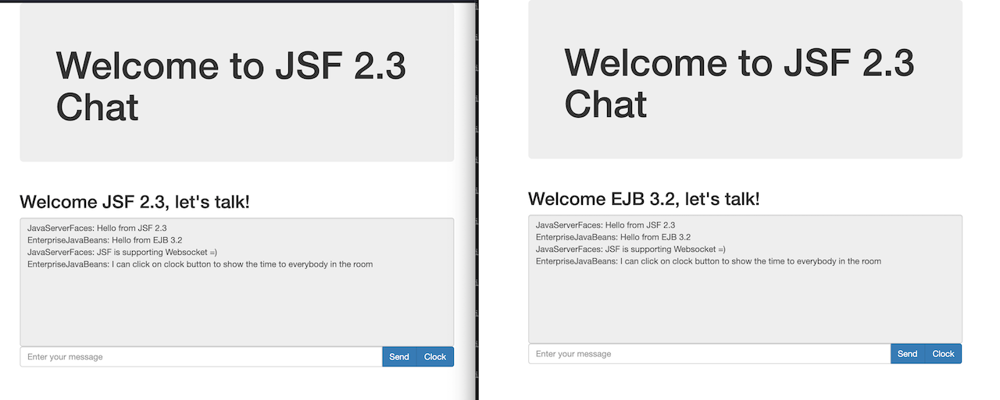

# JSF 2.3 Chat

Simple chat to show some new features JSF 2.3 + CDI 2.0 + Bean Validation 2.0

Start Glassfish: `./asadmin start-domain domain1`

URL: `https://localhost:8080/jsf-chat`

### Features

* JSF 2.2 - HTML5 Friendly Markup
* JSF 2.3 - Selectors
* JSF 2.3 - JS code from managed bean
* JSF 2.3 - Artifacts injection
* JSF 2.3 - f:webSocket
* WebSocket 1.1 - Tomcat already provides

Picture:

#### Some notes

* Spec JSF 2.3: Section 5.9 "As of version 2.3 of this specification, JSF must run in a container that supports CDI version 2.0"
* When running on Glassfish 5 sometimes we can get a NPE which could be related to this [issue](https://github.com/ocpsoft/rewrite/issues/265)

Migration:

* Changed imports from `javax` to `jakarta`
* Changed references from `javax` to `jakarta` in files: `web.xml`, `Context.xml` and `jsf_messages.properties`

Tested on:

* Java EE 8 (using refs `javax`)
* Jakarta EE 8 (using refs `javax`)
* Jakarta EE 9 (using refs `jakarta`)
* TomEE 8 (supports only Java EE 8 / Jakarta EE 8, use [this branch](https://github.com/wesleyegberto/jakartaee-jsf-chat/tree/tomee-8) to run)

### Links

* https://www.javacodegeeks.com/2017/03/testing-java-ee-8-specifications.html
* https://dzone.com/articles/javaserver-faces-23-1
* https://javaserverfaces.java.net/nonav/2.3/whatsnew.html
* http://www.omnifaces-fans.org/p/jsf-23-tutorial.html
* http://arjan-tijms.omnifaces.org/p/jsf-23.html
* http://www.omnifaces-fans.org/2015/12/jsf-23-default-producer-example.html
* https://github.com/AnghelLeonard/JSF-2.3
